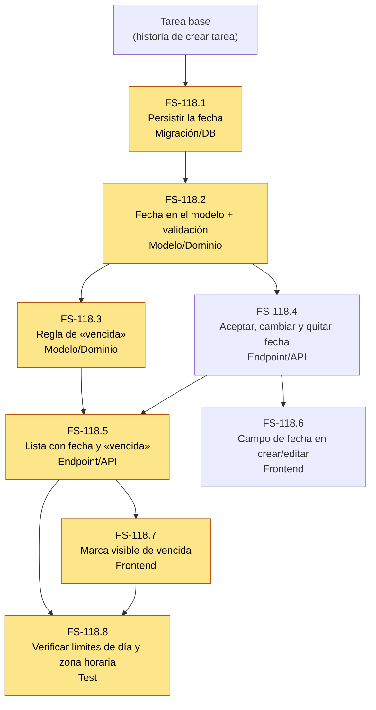

# Tickets de FS-118 — Fecha de vencimiento y tareas vencidas

**Historia:** [FS-118](us-fechas-vencimiento.md)
**Épica:** E2 Gestión de tareas

Cada ticket hereda los criterios de la historia (los números remiten a `us-fechas-vencimiento.md`). Su Definition of Done es una checklist de cómo se entrega: no añade criterios nuevos. Los tickets nombran la capa que tocan y no diseñan; esas decisiones son de la implementación.

**Dependencia externa:** la tarea base (la historia de crear tarea) aún no tiene ID.

## Tickets

### FS-118.1 — Persistir la fecha de vencimiento opcional de la tarea

- **Tipo:** Migración/DB
- **Criterios heredados:** 1–5
- **Dependencias:** tarea base
- **Definition of Done:**
  - [ ] La migración se aplica y se revierte sin errores.
  - [ ] El esquema generado se regenera con el flujo del repo (sin editarlo a mano) y se commitea.
  - [ ] Las tareas ya existentes siguen intactas tras migrar.
  - [ ] Documentado en el PR cómo volver atrás.

### FS-118.2 — Incorporar la fecha de vencimiento al modelo de tarea con su validación

- **Tipo:** Modelo/Dominio
- **Criterios heredados:** 1–8
- **Dependencias:** FS-118.1
- **Definition of Done:**
  - [ ] Reglas cubiertas con tests unitarios (suite `unit`), incluidos los casos límite de sus criterios.
  - [ ] La lógica vive en el modelo o dominio, no en el controlador ni en la UI.
  - [ ] Imports por subpath y relaciones o getters añadidos solo al modelo, no al esquema generado.
  - [ ] Tests deterministas, con el reloj controlado donde dependan de la fecha.

### FS-118.3 — Regla de «vencida» según el día y la zona horaria de quien mira

- **Tipo:** Modelo/Dominio
- **Criterios heredados:** 9–14, 16, 17
- **Dependencias:** FS-118.2
- **Definition of Done:**
  - [ ] Reglas cubiertas con tests unitarios (suite `unit`), incluidos los casos límite de sus criterios.
  - [ ] La lógica vive en el modelo o dominio, no en el controlador ni en la UI.
  - [ ] Imports por subpath y relaciones o getters añadidos solo al modelo, no al esquema generado.
  - [ ] Tests deterministas, con el reloj controlado donde dependan de la fecha.

### FS-118.4 — Aceptar, cambiar y quitar la fecha al crear y editar una tarea

- **Tipo:** Endpoint/API
- **Criterios heredados:** 1–8
- **Dependencias:** FS-118.2
- **Definition of Done:**
  - [ ] Entrada validada con un validador del repo; los errores llegan en castellano y por campo.
  - [ ] La respuesta usa un transformer y pasa por `serialize()`.
  - [ ] Exige sesión iniciada.
  - [ ] Tests funcionales (suite `functional`) con la BD aislada con los hooks de `testUtils.db()`.
  - [ ] Tipos generados de `.adonisjs/` regenerados y commiteados.
  - [ ] Los criterios heredados quedan cubiertos por al menos un test cada uno.

### FS-118.5 — Entregar en la lista la fecha y si cada tarea está vencida para quien la mira

- **Tipo:** Endpoint/API
- **Criterios heredados:** 9–17
- **Dependencias:** FS-118.3, FS-118.4
- **Definition of Done:**
  - [ ] Entrada validada con un validador del repo; los errores llegan en castellano y por campo.
  - [ ] La respuesta usa un transformer y pasa por `serialize()`.
  - [ ] Exige sesión iniciada.
  - [ ] Tests funcionales (suite `functional`) con la BD aislada con los hooks de `testUtils.db()`.
  - [ ] Tipos generados de `.adonisjs/` regenerados y commiteados.
  - [ ] Los criterios heredados quedan cubiertos por al menos un test cada uno.

### FS-118.6 — Campo de fecha al crear y editar la tarea, con aviso de fecha no válida

- **Tipo:** Frontend
- **Criterios heredados:** 1–8
- **Dependencias:** FS-118.4
- **Definition of Done:**
  - [ ] Toda llamada nueva a la API se añade en `lib/api.ts`.
  - [ ] Los errores (`ApiError` y `fieldErrors`) se muestran junto al campo y en castellano.
  - [ ] Componentes de shadcn traídos por la CLI, sin editarlos a mano.
  - [ ] `npm run build` y `npm run lint` pasan limpios, y el formato Prettier está aplicado.
  - [ ] Revisado a mano en el navegador contra los criterios heredados, porque no hay runner de tests en el frontend.

### FS-118.7 — Marca visible de vencida en la lista, compatible con el filtro por estado

- **Tipo:** Frontend
- **Criterios heredados:** 9–15
- **Dependencias:** FS-118.5
- **Definition of Done:**
  - [ ] Toda llamada nueva a la API se añade en `lib/api.ts`.
  - [ ] Los errores (`ApiError` y `fieldErrors`) se muestran junto al campo y en castellano.
  - [ ] Componentes de shadcn traídos por la CLI, sin editarlos a mano.
  - [ ] `npm run build` y `npm run lint` pasan limpios, y el formato Prettier está aplicado.
  - [ ] Revisado a mano en el navegador contra los criterios heredados, porque no hay runner de tests en el frontend.

### FS-118.8 — Verificar los límites de día y de zona horaria

- **Tipo:** Test
- **Criterios heredados:** 13, 16, 17
- **Dependencias:** FS-118.5, FS-118.7
- **Definition of Done:**
  - [ ] Un test por criterio heredado, con nombres que citen el criterio.
  - [ ] Deterministas: reloj y zona horaria fijados, sin depender de la hora real.
  - [ ] Pasan en una BD limpia y sin filtrarse estado entre runs.

## Grafo de dependencias

La flecha `A --> B` significa que A bloquea a B.

Los tickets resaltados forman el camino crítico: FS-118.1 → .2 → .3 → .5 → .7 → .8.

| Ticket | Lo bloquean | Bloquea a |
|---|---|---|
| FS-118.1 | Tarea base | .2 |
| FS-118.2 | .1 | .3, .4 |
| FS-118.3 | .2 | .5 |
| FS-118.4 | .2 | .5, .6 |
| FS-118.5 | .3, .4 | .7, .8 |
| FS-118.6 | .4 | — |
| FS-118.7 | .5 | .8 |
| FS-118.8 | .5, .7 | — |

## Orden de implementación recomendado

1. **FS-118.1 → FS-118.2.** Tramo obligatorio y secuencial: nada más puede empezar hasta que el modelo tenga la fecha.
2. **FS-118.3 y FS-118.4 en paralelo.** Son independientes: la regla de «vencida» y el alta y la edición de la fecha. Con una sola persona, primero FS-118.4, porque desbloquea FS-118.6.
3. **FS-118.6 en paralelo con FS-118.5.** En cuanto termina FS-118.4, el frontend de la fecha puede arrancar sin esperar a la regla de «vencida».
4. **FS-118.5**, cuando estén FS-118.3 y FS-118.4. Es el punto de unión de las dos ramas.
5. **FS-118.7.** La marca visible depende solo de FS-118.5.
6. **FS-118.8.** Va al final, porque verifica los límites de día y zona horaria sobre el resultado completo.

**Camino crítico:** FS-118.1 → .2 → .3 → .5 → .7 → .8. Con dos personas, la segunda puede llevar FS-118.4 y FS-118.6 mientras la primera avanza por la regla de «vencida».

## Notas

- **Criterio 17:** FS-118.3, .5 y .8 asumen que «vencida» depende de quien mira. Es el [SUPUESTO] del punto abierto 6 del PRD. Si el equipo elige otra opción, cambian los tres. La rama de «poner la fecha» (.4 y .6) no se ve afectada.
- **Frescura de la fecha:** el PRD no define si un cambio de fecha hecho por otra persona debe verse en vivo. Quedó fuera de estos tickets; si se decide, sería un ticket nuevo de E3.
